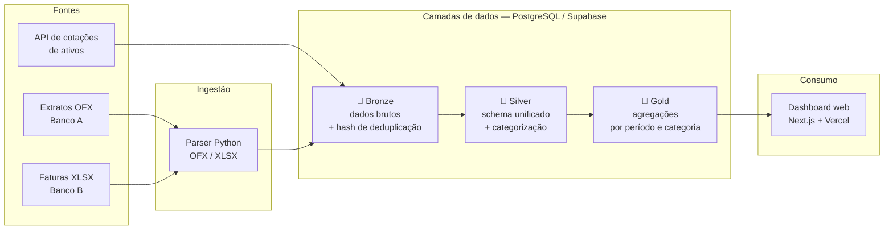

# 💰 Finanças Pipeline

**Pipeline de dados que consolida extratos bancários e faturas de cartão em uma base analítica única, com categorização automática e visualização web.**

[](#)
[](#)
[](#)
[](#)
[](#)

🔗 **Aplicação em produção:** [financas-pipeline.vercel.app](https://financas-pipeline.vercel.app)

---

## 🎯 O problema

Eu tinha conta em dois bancos e faturas de cartão em formatos diferentes (OFX e XLSX). Para saber quanto eu havia gasto em uma categoria no mês, o caminho era baixar cada arquivo, abrir no Excel, padronizar as colunas na mão e tentar somar — um processo manual, demorado e que quebrava a cada mudança de layout dos bancos.

Este projeto resolve isso como um problema de engenharia de dados: ingestão de múltiplas fontes heterogêneas, normalização em camadas, regras de categorização versionadas e uma camada de consumo pronta para análise.

---

## 🏗️ Arquitetura

O pipeline segue uma **arquitetura em camadas (medallion)**, em que cada estágio tem uma responsabilidade única e os dados nunca são sobrescritos na origem.



### Responsabilidade de cada camada

| Camada | O que faz | Por que existe |
|---|---|---|
| 🥉 **Bronze** | Guarda a transação exatamente como veio da fonte, com hash de deduplicação | Permite reprocessar tudo sem baixar os arquivos de novo quando uma regra muda |
| 🥈 **Silver** | Unifica schemas dos bancos, normaliza datas/valores e aplica regras de categorização | É onde a lógica de negócio vive — isolada da ingestão |
| 🥇 **Gold** | Materializa agregações por mês, categoria e conta | O front consulta tabela pronta, não faz agregação em tempo de request |

---

## 🧠 Decisões técnicas

Três escolhas que definiram o desenho do projeto:

**1. Ingestão idempotente via hash, não via data de execução**
Cada transação recebe um hash determinístico de (data + valor + descrição + conta). Reimportar o mesmo extrato duas vezes não gera duplicata. Isso importa porque extratos bancários se sobrepõem — o arquivo de fevereiro frequentemente traz os últimos dias de janeiro. Alternativa descartada: controlar por data do último processamento, que quebra em qualquer reimportação retroativa.

**2. Categorização por regras versionadas no banco, não hardcoded**
As regras de categoria ficam em tabela, não no código. Assim eu ajusto uma classificação errada sem fazer deploy, e o histórico de mudanças fica auditável. O custo é ter que validar regex vinda do usuário — resolvido com limite de tamanho e de quantificadores.

**3. Camada Gold materializada em vez de views**
As agregações são tabelas materializadas, não views calculadas na consulta. Para o volume atual uma view resolveria, mas materializar mantém o tempo de resposta do dashboard estável conforme a base cresce e separa claramente o custo de processamento do custo de leitura.

---

## 📊 Resultado

<!-- ⚠️ SUBSTITUIR: coloque aqui 1 ou 2 prints do dashboard.
     Suba as imagens em docs/img/ e referencie assim: -->


> Este é o item de maior peso do README para quem avalia rápido. Um print do resultado vende mais que qualquer descrição de código.

---

## 🛠️ Stack

| Camada | Tecnologia |
|---|---|
| Ingestão | Python, `ofxparse`, `pandas` |
| Armazenamento | PostgreSQL (Supabase) |
| Transformação | SQL versionado em `sql/` |
| Orquestração | GitHub Actions (schedule) |
| Aplicação web | Next.js, TypeScript, Vercel |
| Segurança | Row-Level Security no Postgres, auth via Supabase |

---

## 🚀 Como rodar

**Pré-requisitos:** Python 3.11+, Node 20+, uma instância Postgres (ou projeto Supabase).

```bash
# 1. Clonar e instalar
git clone https://github.com/diegoscs/financas-pipeline.git
cd financas-pipeline
pip install -r requirements.txt

# 2. Configurar variáveis
cp .env.example .env
# preencher DATABASE_URL, SUPABASE_URL, SUPABASE_ANON_KEY

# 3. Criar o schema (na ordem numérica dos arquivos)
psql $DATABASE_URL -f sql/01_schema.sql

# 4. Ingerir um extrato
python -m ingestion.run --file caminho/do/extrato.ofx

# 5. Subir o front local
cd web && npm install && npm run dev
```

<!-- ⚠️ CONFERIR: ajuste os comandos acima para os nomes reais dos seus arquivos
     e crie um .env.example no repo — README que cita arquivo inexistente
     é pior que README curto. -->

---

## 📁 Estrutura

```
financas-pipeline/
├── ingestion/        # parsers OFX/XLSX e carga na bronze
├── sql/              # DDL e transformações bronze → silver → gold
├── scripts/          # utilitários pontuais de manutenção
├── web/              # aplicação Next.js
├── docs/             # diagramas e imagens
└── .github/workflows # agendamento da carga
```

---

## 🗺️ Próximos passos

- [ ] Testes de qualidade de dados nas transições entre camadas
- [ ] Log de execução por carga (início, status, linhas processadas)
- [ ] Alerta de falha de ingestão
- [ ] Ingestão de novas fontes de extrato

---

## 👤 Autor

**Diego Soares** — Analista de Dados / Engenharia de Dados
[LinkedIn](https://www.linkedin.com/in/diego-soares-8b0850222/) · [GitHub](https://github.com/diegoscs)
